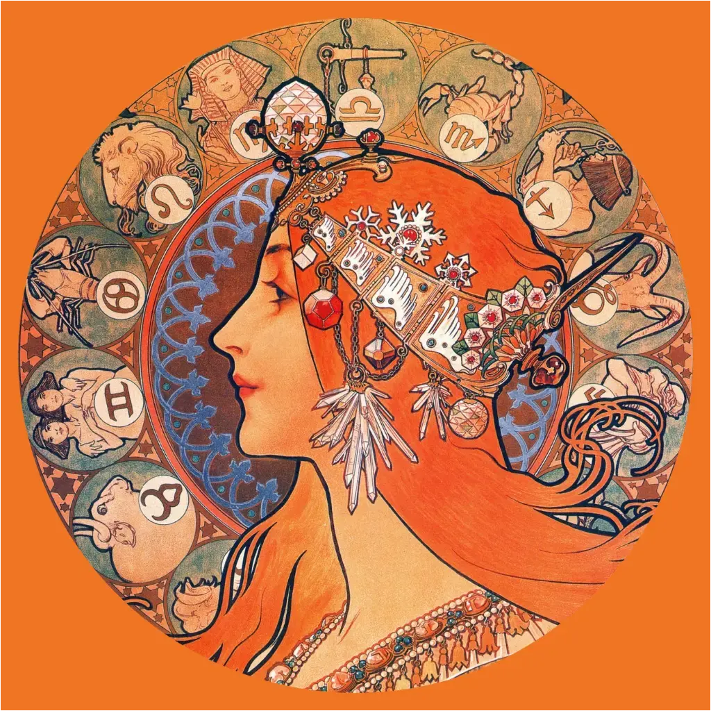

<!-- I think this may be too much img lol
 
-->

[](https://www.linkedin.com/in/bymichaeljon)
[](https://jonblack.gg/)
[](https://open.spotify.com/user/bios_)
<!-- [](https://www.last.fm/user/Bios_) -->
<!-- [](https://github.com/BiosPlus) -->

---

## Heyo 😊

My name is Michael Jon **(he/him)**, aka:
- Jon Black [(jonblack.gg)](https://jonblack.gg)
- BiosPlus [(bios.plus)](https://bios.plus)

But people just call me Mike / Micky B / Hey You / Bios for short.

## The TL:DR

- 📍 Location: Melbourne, Victoria, Australia.
- 🤼 Personal Time: Budding professional wrestler. Habitual jokester.
- 📫 How to reach me: Shout really loudly into the void *(or mutter that Omega v Okada 4 was not the best of the series ***(you're wrong)***)*. But really, you can open a [discussion in here](https://github.com/BiosPlus/BiosPlus/discussions).
- ✍️ My quote? ***"I'll live, I always do"*** or ***"Ass"***

## My Public SSH Key
```sh
ssh-ed25519 AAAAC3NzaC1lZDI1NTE5AAAAIIyhYjZqvTfUTM5Kg0T1pWVPJQLN5JVBi1AoqE1PKIC5
```

## Tools of choice.

| Purpose | Preference | Alternatives |
|---:|:---:|:---:|
| OS | [](https://www.apple.com/macos) [](https://www.microsoft.com/windows) | [](https://ubuntu.com) |
| Connection Manager | [](https://xpipe.io) | [](https://termius.com) |
| Containerisation | [](https://www.docker.com) [](https://rancher.com) | [](https://kubernetes.io) |
| DNS | [](https://www.cloudflare.com) | [](https://aws.amazon.com/route53) |
| Frontend Frameworks | [](https://getbootstrap.com) | [](https://tailwindcss.com) |
| Hosting - Code | [](https://github.com) [](https://github.com/features/actions) | [](https://gitlab.com) |
| Hosting - General | [](https://www.digitalocean.com) [](https://cloud.google.com) [](https://www.hetzner.com) | [](https://aws.amazon.com) [](https://azure.microsoft.com) |
| Hosting - Static/Serverless | [](https://pages.cloudflare.com) | [](https://pages.github.com)  |
| IDE | [](https://code.visualstudio.com) | - |
| Terminal - MacOS | [](https://tabby.sh) [](https://ohmyz.sh) | [](https://iterm2.com) [](https://termius.com)  |
| Terminal - Windows | [](https://tabby.sh) [](https://docs.microsoft.com/powershell) | [](https://termius.com)  |
| Web Runtimes | [](https://nodejs.org) | - |
| Web Server | [](https://caddyserver.com) [](https://www.nginx.com) | [](https://httpd.apache.org) |

---

## The Fun Stuff

I have **43** tattoos as of 2024/04/26

---

<table>
    <tr>
        <tr>
            <td colspan="2"><center>Some of my past profile pictures ;)</center></td>
        </tr>
    <tr>
        <td></td>
        <td></td>
    </tr>
    <tr>
        <td><center>Burger Time</center></td>
        <td><center>Mucha's Zodiac</center></td>
    </tr>
</table>

---

*```Forking my README.md is lazy```*
